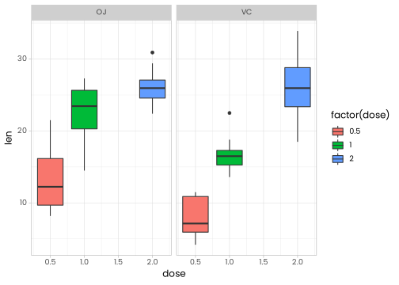
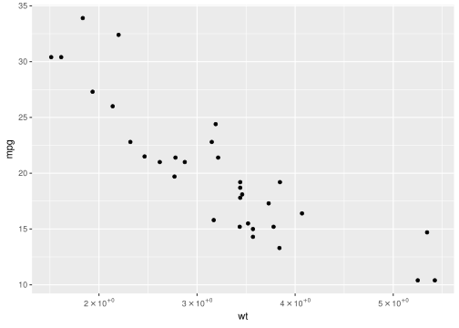

<!-- README.md is generated from README.Rmd. Please edit that file -->

# ggpmthemes

<!-- badges: start -->

[](https://github.com/PMassicotte/ggpmthemes/actions)
<!-- badges: end -->

Simple R package with custom ggplot2 themes.

## Installation

You can install the development version from
[GitHub](https://github.com/) with:

``` r
# install.packages("devtools")
devtools::install_github("PMassicotte/ggpmthemes")
```

## Examples

### Theme Poppins

``` r
library(ggpmthemes)
library(ggplot2)

p <- ggplot(ToothGrowth, aes(x = dose, y = len, group = dose)) +
  geom_boxplot(aes(fill = factor(dose))) +
  facet_wrap(~supp)

p +
  theme_poppins()
```



``` r
p +
  theme_exo2()
```


Works also with `geom_text()`

``` r
p <- ggplot(mtcars, aes(wt, mpg, label = rownames(mtcars))) +
  geom_text(check_overlap = TRUE)

p +
  theme_poppins()
```


``` r
p +
  theme_exo()
```


### Scientific format

``` r
ggplot(mtcars, aes(wt, mpg, label = rownames(mtcars))) +
  geom_point() +
  scale_x_continuous(labels = scientific_10x)
```



Please note that the ‘ggpmthemes’ project is released with a
[Contributor Code of Conduct](CODE_OF_CONDUCT.md). By contributing to
this project, you agree to abide by its terms.
